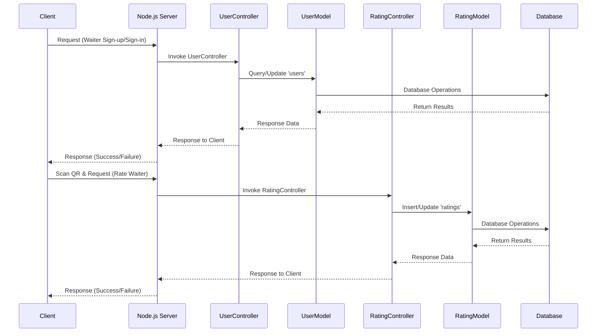

```mermaid 
sequenceDiagram
    participant C as Client
    participant S as Node.js Server
    participant UC as UserController
    participant UM as UserModel
    participant RC as RatingController
    participant RM as RatingModel
    participant DB as Database

    C->>S: Request (Waiter Sign-up/Sign-in)
    S->>UC: Invoke UserController
    UC->>UM: Query/Update 'users'
    UM->>DB: Database Operations
    DB-->>UM: Return Results
    UM-->>UC: Response Data
    UC-->>S: Response to Client
    S-->>C: Response (Success/Failure)

    C->>S: Scan QR & Request (Rate Waiter)
    S->>RC: Invoke RatingController
    RC->>RM: Insert/Update 'ratings'
    RM->>DB: Database Operations
    DB-->>RM: Return Results
    RM-->>RC: Response Data
    RC-->>S: Response to Client
    S-->>C: Response (Success/Failure)

```